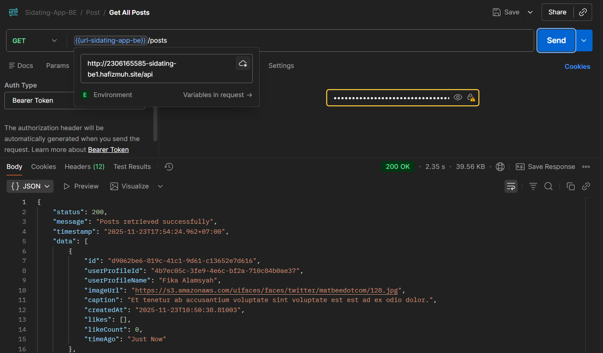
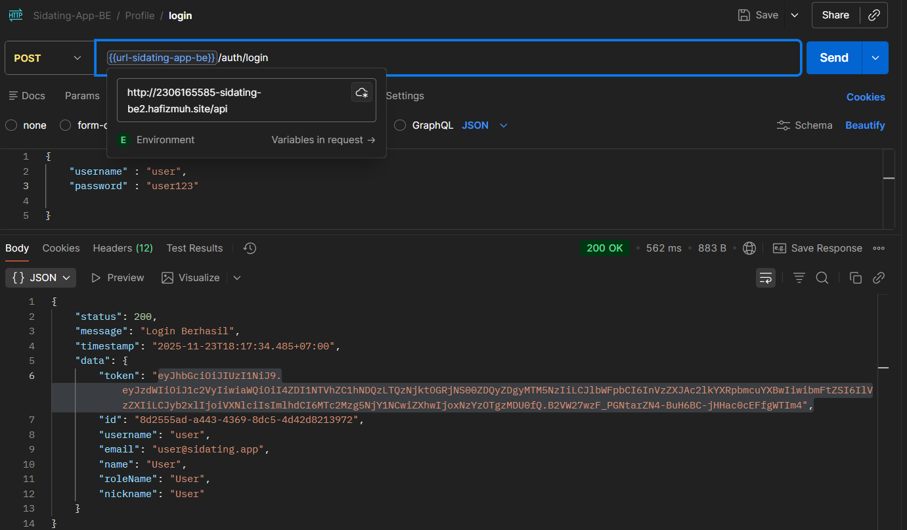
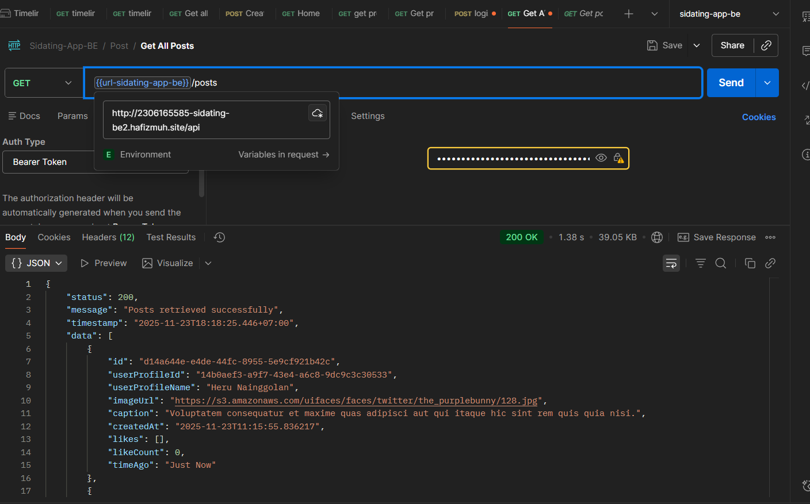
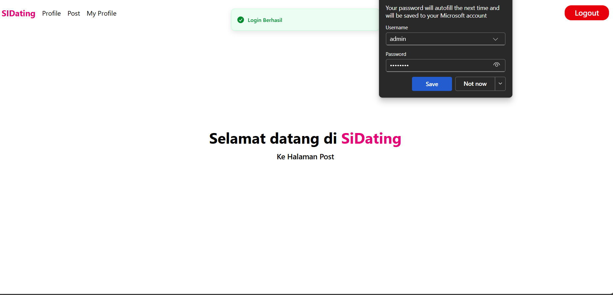
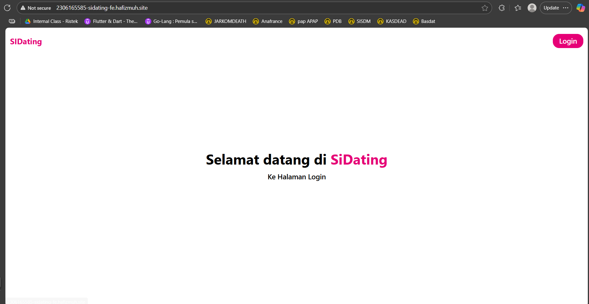
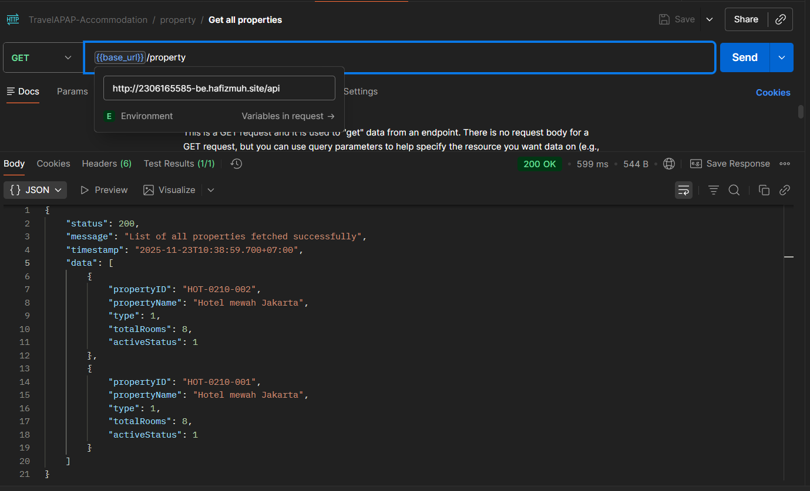
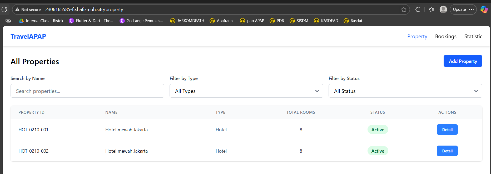
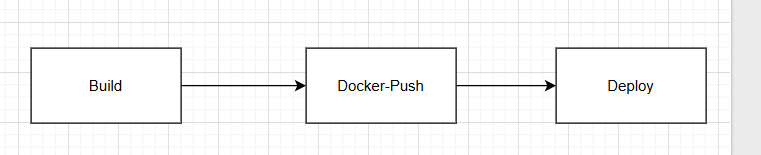
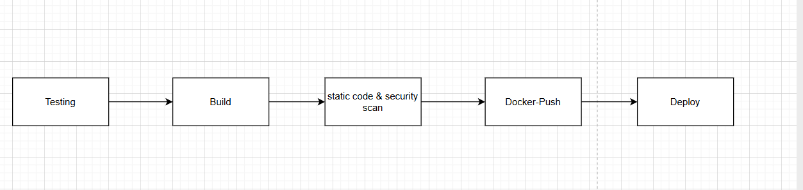

# Read Me First
The following was discovered as part of building this project:

* The original package name 'apap.ti.2025.accommodation-2306165585-be' is invalid and this project uses 'apap.ti._5.accommodation_2306165585_be' instead.

# TravelAPAP - Accommodation Backend

This is the Accommodation microservice of the TravelAPAP ecosystem, built using Spring Boot.
It was developed as part of the Enterprise Application Programming (CSIM603026) course, Faculty of Computer Science, Universitas Indonesia, Academic Year 2025/2026 (Odd Semester).

Created by:

- Name: Muhammad Hibrizi Farghana
- NPM: 2306165585

## How to run this project locally?
1. Setup your local database using DBeaver or Docker
2. Clone this project to your local device 
3. Create a `.env` file at the root of this project. Refer to `.env.example` for the content of `.env` file.
4. Open a terminal with this project as the path.
5. Run `./gradlew bootRun` to run the project

## REPO GITHUB
Dalam pengerjaan tutorial ini, saya mendapatkan berbagai masalah dengan Gitlab. Oleh karena itu, saat ini deployment saya yang berhasil untuk TI berada pada repository Github saya. 

Berikut ini adalah url untuk repository github TI saya

repo backend-TI : https://github.com/easy-farghana/TI-BE-APAP-2306165585/tree/feat/praktikum-9
repo frontend-TI: https://github.com/easy-farghana/TI-FE-APAP-2306165585/tree/feat/praktikum-9

Saya juga ada mencoba untuk menggunakan github actions untuk frontend praktikum, tetapi untuk repository ini sebagai tambahan dan uji coba saja karena yang di gitlab juga berhasil

repo frontend-sidating: https://github.com/easy-farghana/SIDATING-FE-APAP-2306165585/tree/feat/praktikum-9

## Pertanyaan ReadMe

1. Bukti Screenshot 

* Screenshot Backend Sidating-BE-1 Test 1

* Screenshot Backend Sidating-BE-1 Test 2

* Screenshot Backend Sidating-BE-2 Test 1

* Screenshot Backend Sidating-BE-2 Test 2

* Screenshot Frontend Sidating Test 1

* Screenshot Frontend Sidating Login

* Screenshot Backend TI

* Screenshot Frontend TI

2. Gambar pipeline CI/CD

Pada praktikum ini, pipeline kita melakukan 3 stage, yaitu build --> docker-push --> kemudian deployment

* Build

    Pada tahap ini, pipeline akan membangun dan mengkompliasi aplikasi menjadi .jar  

* docker-push

    Pada tahap ini, pipeline akan membangun Docker image dari artefak hasil build dan kemudian mengunggah (push) image tersebut ke Docker registry agar image dapat digunakan untuk deployment di server atau cluster Kubernetes.

* deployment

    Pada tahap ini, pipeline akan menerapkan image Docker ke cluster Kubernetes, membuat atau memperbarui pod, service, dan ingress sesuai konfigurasi YAML

3. Gambar improved pipeline CI/CD dan penjelasannya

Salah satu improvement yang dapat digunkan pada pipeline saat ini adalah dengan menerapkan DevSecOps, yaitu dengan mempertimbangkan security dan testing dalam pipeline.

Alur pipeline yang ditingkatkan menjadi:

* Testing

    Tahap ini menjalankan unit dan integration test untuk memastikan kode berjalan sesuai fungsinya sebelum masuk ke tahap build.

* Build

    Pada tahap ini, aplikasi dibangun dan dikompilasi, menghasilkan artefak seperti JAR atau binary yang siap dijadikan Docker image.

* Static Code & Security Scan 

    Tahap ini melakukan analisis kualitas kode, dependency, dan image Docker untuk mendeteksi bug atau kerentanan keamanan sebelum deployment.

* Docker-Push 

    Image Docker yang sudah lolos test dan scan akan dibangun dan diunggah ke Docker registry, agar dapat digunakan untuk deployment.

* Deployment 

    Tahap terakhir, pipeline menerapkan image ke cluster Kubernetes, membuat atau memperbarui pod, service, dan ingress sesuai konfigurasi, sehingga aplikasi berjalan stabil dan dapat diakses sesuai environment.

4. Kenapa pakai elastic ip

Elastic IP digunakan agar IP dari instance tidak berubah-ubah. Jika tidak menggunakan elastic ip, kita perlu mengganti ENV dari EC2_HOST setiap kali kita menjalankan ulang EC2 Instance. Maka dari itu, elastic IP digunakan agar ip address tetap sama dan kita tidak perlu untuk mengganti-ganti ENV repository setiap mau push. 

5. Perbedaan utama Docker dan Kubernetes pada praktikum ini

Dalam praktikum ini, kita menggunakan Docker sebagai kontainer di mana aplikasi dibuat dan dijalankan dalam satu environment yang sama. Dengan demikian, tidak ada lagi kata "it works on my machine" karena Docker memastikan semua orang menjalankan aplikasi di lingkungan yang konsisten.

Sementara itu, Kubernetes berfungsi sebagai pengelola container di server atau cluster. Kubernetes menyimpan, menjalankan, dan mengatur container Docker secara otomatis, termasuk menyesuaikan jumlah container sesuai kebutuhan, memastikan container selalu berjalan dengan baik, serta menyediakan load balancing dan service discovery agar aplikasi tetap stabil dan mudah dikelola dalam skala besar.

6. Proses mana yang paling penting pada pipeline

Menurut saya, proses yang paling penting pada pipeline ada di bagian build. Jika build tidak berhasil, maka pipeline tidak akan dapat melanjutkan ke tahap-tahap selanjutnya. Selain itu, kalau pun build berhasil, jika kita mengkonfigurasi build secara tidak benar, maka aplikasi kita juga tidak akan berjalan dengan benar pada server. 

7. Penjelasan 5 file konfigurasi (deployment.yaml, ingress.yaml, service.yaml, secret.yaml, config.yaml)

* deployment.yaml

Mendefinisikan deployment aplikasi, termasuk jumlah replika pod, image Docker yang digunakan, port container, dan environment variable yang diambil dari ConfigMap atau Secret. File ini memastikan pod aplikasi dijalankan secara konsisten di cluster.

* service.yaml

Membuat service untuk mengatur akses ke pod. Pada praktikum ini menggunakan tipe ClusterIP, sehingga service dapat diakses dari dalam cluster dan memfasilitasi komunikasi antar pod.

* ingress.yaml

Mengatur akses HTTP/S dari luar ke service di cluster. File ini menentukan host, path, dan backend service yang dituju, sehingga aplikasi bisa diakses melalui domain tertentu.

* configmap.yaml (ConfigMap)

Menyimpan konfigurasi aplikasi yang tidak sensitif, seperti URL database dan username. ConfigMap digenerate oleh CI pipeline agar konfigurasi dapat diubah tanpa memodifikasi image Docker.

* secret.yaml

Menyimpan data sensitif seperti password database dan CORS allowed origins. Secret juga digenerate oleh CI pipeline sehingga informasi sensitif tidak tersimpan langsung di repository.

8. Start on restart

Untuk docker database, saya berhasil mengaktifkan start on restart dengan dua cara:

* Langsung set `restart: always` di file docker-compose. Inilah yang saya lakukan untuk database TI. Dengan ini, docker akan selalu dijalankan ketika mesin (instance) menyala. 

* Dengan menjalankan `docker update --restart=always <nama-container>`. Secara teknis, ini adalah hal yang sama dengan cara yang pertama, tetapi set nya melalui CLI alih-alih langsung di-set dalam file docker-compose.  Cara inilah yang digunakan pada panduan dan yang saya ikuti untuk aplikasi sidating

Sementara itu, untuk deployment, secara default start on restart policy akan aktif meskipun tidak di-set. Hal ini dikarenakan kubernetes secara default telah mengatur restartPolicy dengan nilai always. Hal ini dapat dilihat pada dokumentasi resmi mereka, yaitu pada https://kubernetes.io/docs/concepts/workloads/pods/pod-lifecycle/. Di situ, tertulis secara langsung bahwa "The spec of a Pod has a restartPolicy field with possible values Always, OnFailure, and Never. The default value is Always.". Oleh karena itulah start on restart telah aktif meskipun tidak di-set secara manual.

9. Keuntungan dari menerapkan kubernetes dibandingkan langsung run image docker di server

Menerapkan Kubernetes memberikan keuntungan dalam manajemen container yang lebih otomatis dan terstruktur dibandingkan menjalankan Docker langsung di server. Dengan Kubernetes, container dapat dikelola dalam skala besar melalui deployment, scaling, dan pemeliharaan otomatis. Selain itu, Kubernetes menyediakan load balancing, service discovery, dan pemulihan otomatis jika container gagal, sehingga aplikasi lebih stabil dan mudah diatur dibandingkan menjalankan image Docker secara manual pada setiap server.

10. Perbedaan ClusterIP, NodePort, dan LoadBalancer dan mengapa praktikum pakai ClusterIP

ClusterIP, NodePort, dan LoadBalancer adalah tipe service di Kubernetes untuk mengatur akses ke aplikasi. ClusterIP hanya bisa diakses dari dalam cluster, NodePort membuka port tertentu agar dapat diakses dari luar cluster, sedangkan LoadBalancer menyediakan IP publik dan distribusi beban otomatis jika menggunakan cloud provider. Dalam praktikum ini digunakan ClusterIP karena cukup untuk komunikasi antar service dalam cluster dan lebih sederhana tanpa perlu expose ke luar sehingga sesuai dengan kebutuhan belajar dan menjaga keamanan lingkungan praktikum.

11. Pelajaran terpenting yang kamu dapatkan

Pelajaran terpenting yang saya dapatkan adalah betapa pentingnya CI/CD untuk memudahkan proses deployment dan manajemen lifecycle aplikasi. Dengan CI/CD, update aplikasi bisa dilakukan secara cepat, konsisten, dan terstruktur sehingga tim pengembang dapat lebih fokus pada pengembangan fitur daripada mengurus deployment secara manual. Selain itu, penerapan CI/CD dengan kontainerisasi dan Kubernetes membantu integrasi antar layanan menjadi lebih rapi dan memastikan aplikasi berjalan lebih stabil di cluster. Dengan adanya pipeline otomatis, kolaborasi antar tim menjadi lebih efisien dan proses rollback saat ada masalah pun bisa dilakukan dengan cepat. Meskipun demikian, CI/CD sangat rentan kesalahan kecil seperti typo pada konfigurasi sehingga ketelitian menjadi hal yang krusial.