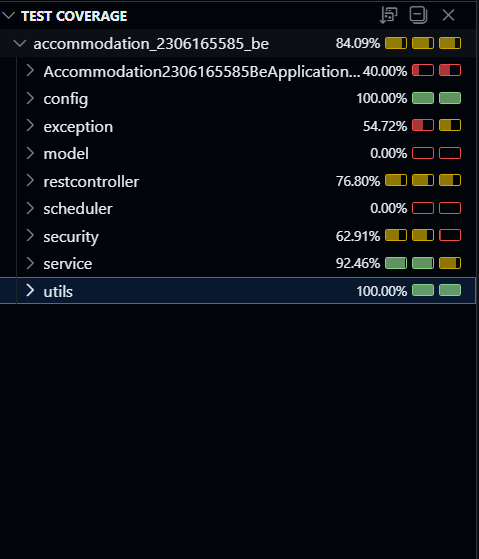
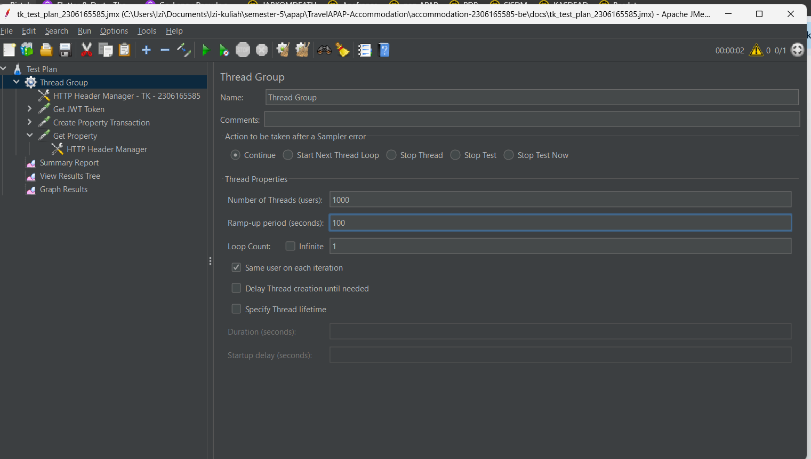
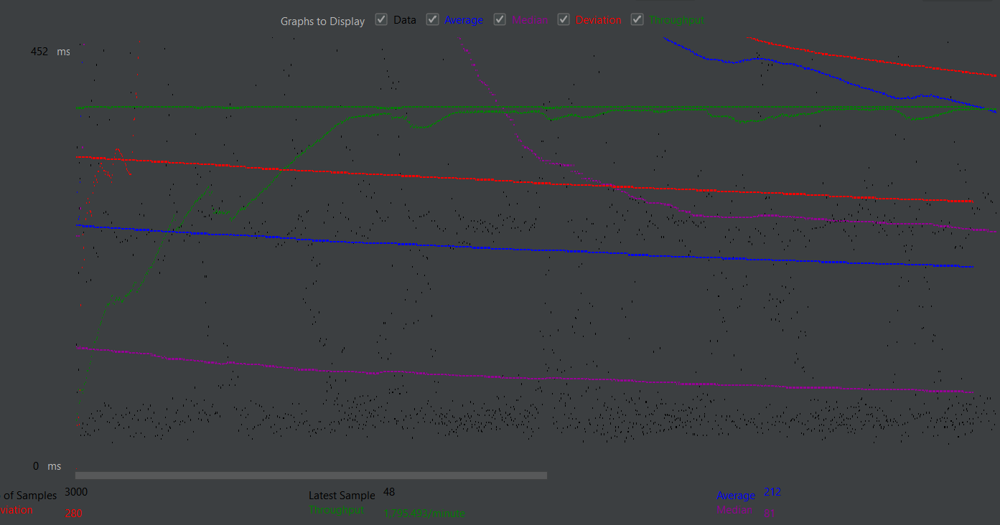
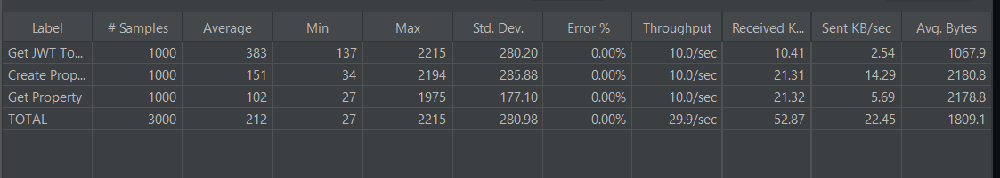

## Unit Test - Coverage

## Load Testing

Load testing pada aplikasi ini saya lakukan dengan cukup sederhana akibat keterbatasan waktu. 

Pada test plan yang saya jalankan, saya juga menjalankan modul Profile untuk melakukan autentikasi, jadi load testing ini membutuhkan agar 2 modul untuk berjalan di saat yang bersamaan. Load-testing ini dijalankan secara local.

Flow dari test plan sederhana
--> user login sebagai superadmin
--> superadmin POST request Transaksi Property  (include RoomType dan Room)
--> superadmin GET request property yang dibuat dari pembuatan property

File .jmx saya dapat diakses pada link berikut:

[tk_test_plan_2306165585.jmx](/load-testing/tk_test_plan_2306165585.jmx)

[Graph Results.jmx](<load-testing/Graph Results.jmx>)

[Summary Report.jmx](<load-testing/Summary Report.jmx>)

[View Results Tree.jmx](<load-testing/View Results Tree.jmx>)

